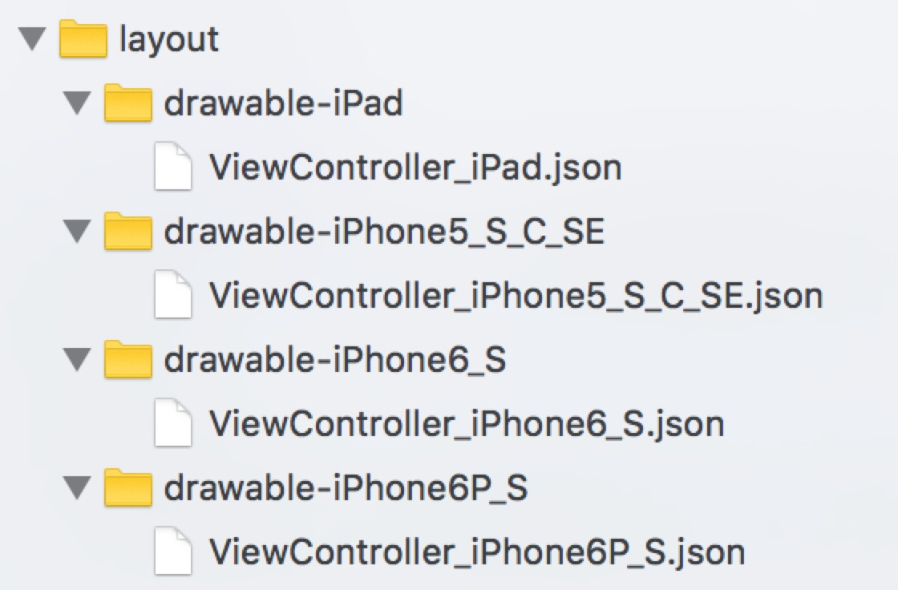

<p align="center">

</p>

<p align="center">
<a href="https://travis-ci.org/beichenming/BMLayoutConstraint"></a>
<a href="https://img.shields.io/cocoapods/v/BMLayoutConstraint.svg"></a>
<a href="https://img.shields.io/cocoapods/v/BMLayoutConstraint.svg"></a>
<a href="https://travis-ci.org/beichenming/BMLayoutConstraint"></a>
<a href="http://beichenming.me"></a>
</p>

BMLayoutConstraint是一套UI布局适配工具，通过JSON配置文件的形式能够快速适配不同设备以及多语言下的UI布局差异，适用于iOS应用程序的开发，通过Object-C编写。

BMLayoutConstraint还在不断完善中，欢迎大家一起。

## 运行环境

- iOS 8+
- Xcode 6+

## 安装

### CocoaPods    

```ruby
pod 'BMLayoutConstraint'
```

Then, run the following command:

```bash
$ pod install
```


## 语言
[英文](https://github.com/beichenming/BMLayoutConstraint/blob/master/README.md)

## 示例
使用BMLayoutConstraint的前提是我们的UI布局采用的是Mansory或者其他纯代码布局的方式，BMLayoutConstraint并不适合xib或者storyboard这种形式的布局方式，我们已Demo为例进行使用说明。

`第一步：我们需要在工程下建立存放配置文件的目录，我们新建五个目录来对应我们的设备类型：`
<p align="left">

</p>

drawable-iPad(768 * 1024)

drawable-iPhone4_S(320 * 480) 

drawable-iPhone5_S_C_SE(320 * 568)

drawable-iPhone6_S(375 * 667)

drawable-iPhone6P_S(414 * 736)

因为iPad的尺寸比较多，所以我们目前使用了一个通用的尺寸表示，如果没有符合的尺寸就使用768 * 1024，未来会继续扩展。

`第二步:针对需要适配的界面，建立对应名字的适配文件，例如我们要对ViewController中的元素布局进行适配就需要建立五个ViewController的json配置文件并以设备名结尾。`

json配置文件格式是通过每一个控件都有自己的唯一ID，每个ID后面可以追加一个语言标志符用来区分同一设备下多语言的适配，可以分为两种情况：

第一种: 同一设备下每种语言的适配都是不一样的，那么就需要为每种语言单独写配置约束，通过ID结尾追加语言标志符。

```
 "UILabel" :
 [
      {
          "bm_ViewControllerPhoneNoLabelID_BM_ZH_HANS_US" :
          {
              "marginLeft" : 30.0,
              "marginRight" : 0.0,
              "marginTop" : 100.0,
              "marginBottom" : 0.0,
              "width" : 100.0,
              "height" : 20.0,
              "fontSize" : 16.0
          }
      },
      {
          "bm_ViewControllerPhoneNoLabelID_BM_EN_US" :
          {
              "marginLeft" : 30.0,
              "marginRight" : 0.0,
              "marginTop" : 100.0,
              "marginBottom" : 0.0,
              "width" : 150.0,
              "height" : 20.0,
              "fontSize" : 16.0
          }
      },
   ]

```
第一种: 同一设备下每种语言的适配都是一样的，那么我们使用通用配置。通过ID结尾追加BM_BASE。

```
 "UILabel" :
 [
      {
          "bm_ViewControllerPhoneNoLabelID_BM_BASE" :
          {
              "marginLeft" : 30.0,
              "marginRight" : 0.0,
              "marginTop" : 100.0,
              "marginBottom" : 0.0,
              "width" : 100.0,
              "height" : 20.0,
              "fontSize" : 16.0
          }
      }
   ]

```
`第三步:在App启动的时候预先读取我们的配置文件就可以了`

```
 [[BMTLayoutConstraintInterpreter sharedInstance] layoutConstraintAsyncWithContainerName:[self getClassName:[ViewController class]]
  												                     andCompletionCallback:nil];
```

## 作者
[北辰明](http://www.jianshu.com/users/5d1e6bd11aa0)
